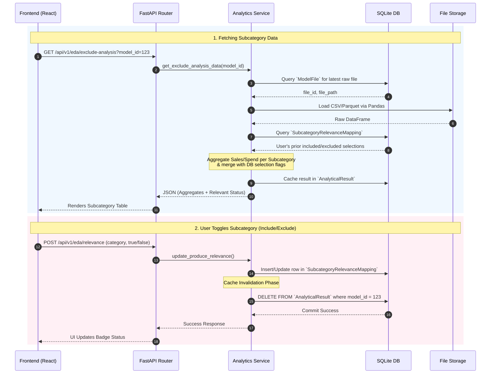
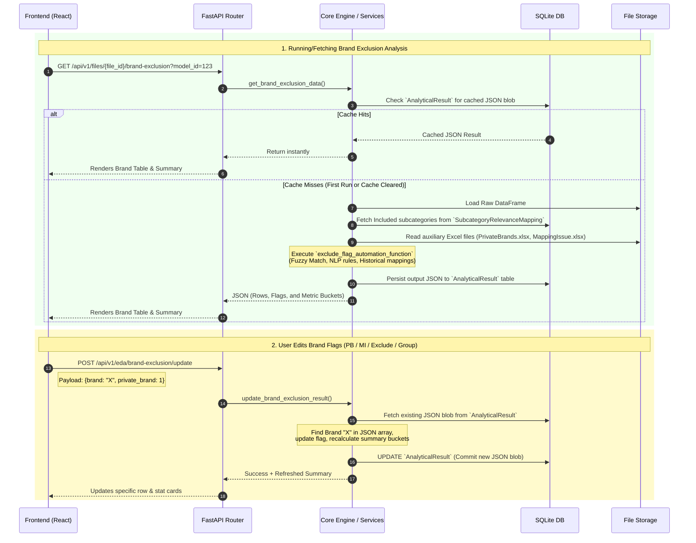
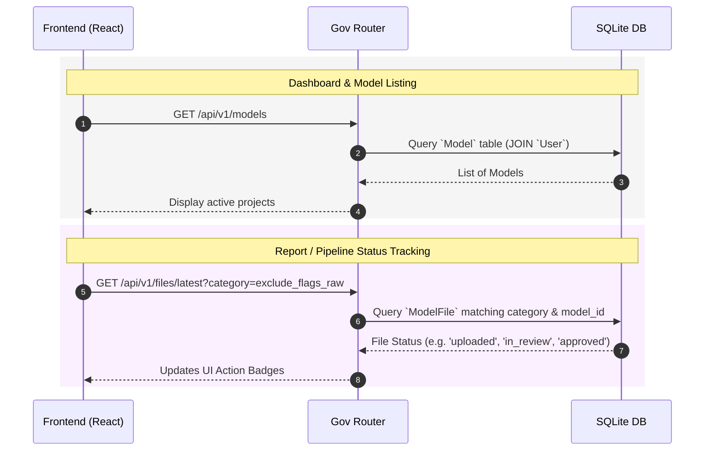

# End-to-End API Data Flow Architecture

Below are the detailed data flow diagrams for the core APIs powering the EDA/Exclude Flags module. 

> **How to import these into Draw.io:**
> 1. Open Draw.io (app.diagrams.net).
> 2. Go to **Arrange -> Insert -> Advanced -> Mermaid...**
> 3. Copy the Mermaid code blocks below (excluding the ````mermaid` tags) and paste them into the box.
> 4. Click **Insert**. Draw.io will automatically generate the editable flowchart blocks!

---

## 1. Phase 1: Subcategory (L3) Analysis Flow

This flow triggers when the user loads the first screen to include or exclude major L3 categories.



---

## 2. Phase 2: Brand Exclusion Analysis Flow

This triggers after Phase 1, when the system runs the heavy NLP mapping rules to filter the actual brands within those selected subcategories.



---

## 3. General Dashboard & Metadata Flow

This API suite manages the projects, uploading files, and generic tracking.


